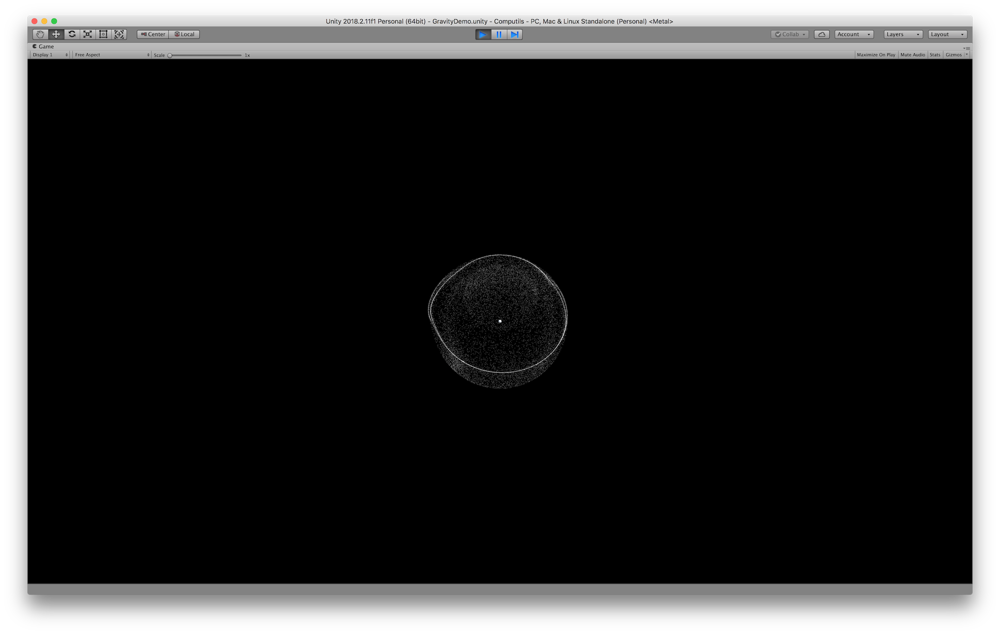

# Computils
Compute Shader tools for Unity

_Only tested on Mac with Unity 2018.2.11f1, 2018.2.16f1 and 2019.2.0f1_

## Installation

Below are verious methods to add this Computils package to your Unity project. 

REQUIREMENTS;
this Computils package requires [this C-Sharp-Promise package](https://github.com/markkorput/C-Sharp-Promise) and
the demos use [this fusetools package](https://gitlab.com/shortnotion/fusetools/), so you are recommended
to add these to your project as well.

#### Manual

Download a zip package of each package's repository and extract the zips into your Unity Assets folder;
* [Zip of Computils master](https://github.com/markkorput/Computils/archive/master.zip)
* [Zip of C-Sharp-Promise master](https://github.com/markkorput/C-Sharp-Promise/archive/master.zip)
* [Zip of fusetools master](https://gitlab.com/shortnotion/fusetools/-/archive/master/fusetools-master.zip)

#### As git submodule(s)

If you are already using git version control in your project, you can add this package as a submodule;
from somewhere inside your assets folder run the following command;

```
git submodule add https://github.com/markkorput/Computils.git
git submodule add https://github.com/markkorput/C-Sharp-Promise.git
git submodule add https://gitlab.com/shortnotion/fusetools.git
```

#### As git clone(s)

If you are not using git version control in your project yet, but still want to use git, you can simply clone the Computils repository;
from somewhere inside your assets folder run the following command;

```
git clone https://github.com/markkorput/Computils.git
git clone https://github.com/markkorput/C-Sharp-Promise.git
git clone https://gitlab.com/shortnotion/fusetools.git
```

## Demo Screenshots


